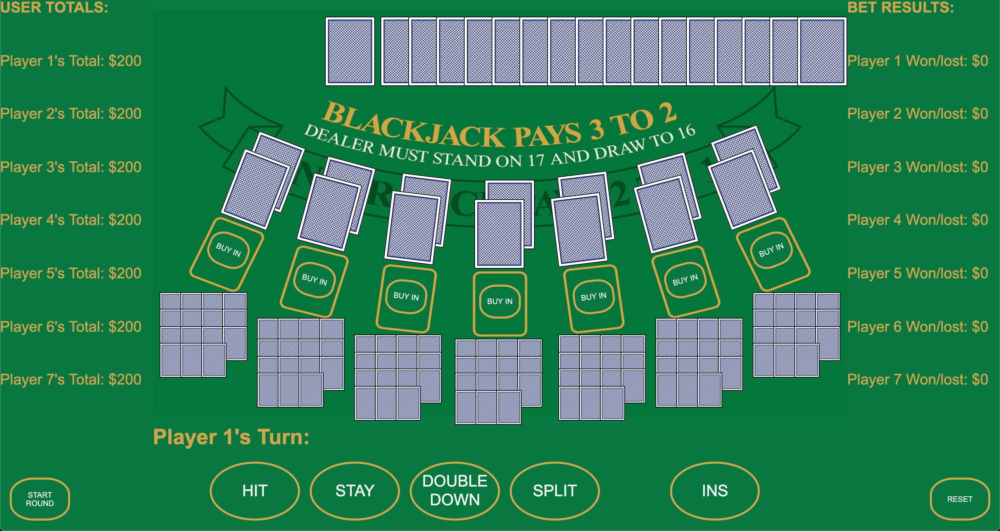

# blackjack-game

## Description
A game where the goal is to hit 21 and or out last the dealer through them busting

## User Stories

### AAU...
- See the game board along with all the available button choices
- Activate (buy in) how many players
- See the dealers cards and the players cards delt
- Make a choice based on the hand
- See a Calculated the outcome (winner/loser) of all hands
- Have winnings or losses added/subtracted from their totals 
- Allow players to join or leave again
- Redeal to all players

## Technologies
HTML
CSS
JavaScript

## Wireframes and Screenshots
### Initial Sketch

### Board shoing all entities

## Future Enhancments
- Let player split
- Tip the dealer
- Dynamic card scrolling