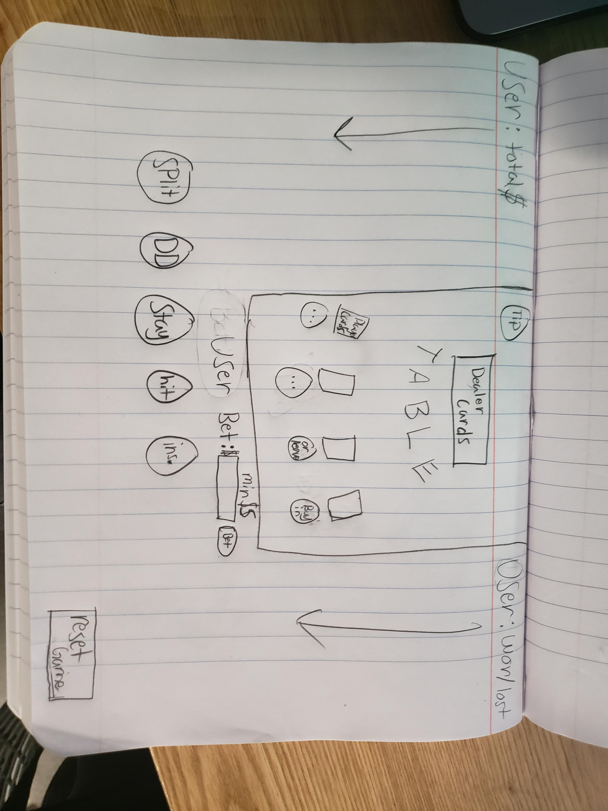

# blackjack-game

## Description
A game where the goal is to hit 21 and or out last the dealer through them busting

## User Stories
- See the game board along with all the available button choices
- Activate (buy in) how many players
- Deal the dealers cards and the players cards
- Let user make a choice based on the hand
- Calculate the outcomes (winner/loser) of all hands
- Give players winnings (and add to total chips)
- Check for new/leaving players
- Redeal to all players

## Technologies
HTML
CSS
JavaScript

## Wireframes and Screenshots

## Future Enhancments
- Let player split, double down, etc.
- Tip the dealer